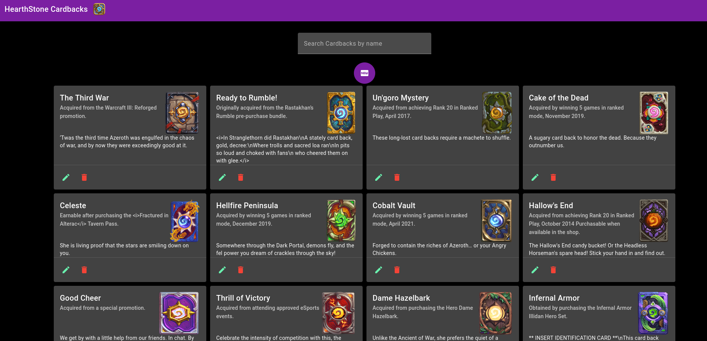

# HearthStone Cardbacks

Este es un proyecto Realizado para una prueba técnica como desarrollador Fron End.



## Tecnologías

Este proyecto fue generado con [Angular CLI](https://github.com/angular/angular-cli) versión 17.2.3. Para ver la compatibilidad entre dependencias ir al siguiente link [Dependencias](https://angular.io/guide/versions).

## ¿Cómo Iniciar?

- Clonar el proyecto.

```bash
git clone https://github.com/robertoMaclean/hearthstone-cardbacks.git
```

Ejecutar `ng serve` para correr en local la aplicación. Ir a `http://localhost:4200/`. La aplicación automáticamente se refrescará al detectar los cambios.

## Generar directivas

Ejecuta `ng generate component component-name` para generar un nuevo componente. Tambien puedes utilizar `ng generate directive|pipe|service|class|guard|interface|enum|module`.

## Build

Ejecuta `ng build` para generar el build del proyecto. El resultado quedará guardado en el directorio `dist/`.

## Demo

Puedes ver la aplicación en el siguiente enlcace [HearthStone CardBacks Demo](https://hearthstone-cardbacks.netlify.app).

## Ayuda

Para obtener ayuda usando Angular CLI usa `ng help` ve a [Angular CLI Descripción general y lista de Commandos](https://angular.io/cli).
